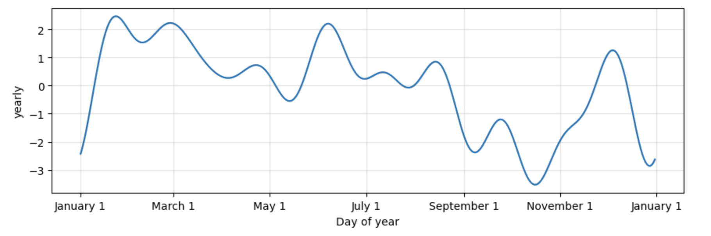
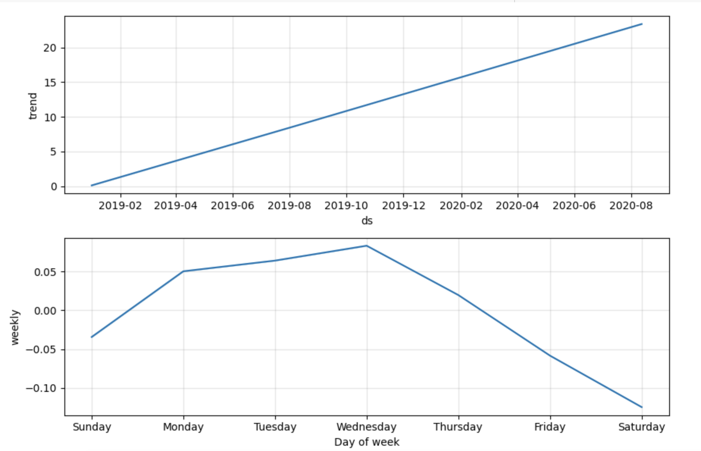

## Time Series analysis for MercadoLibre, Inc. 
[MercadoLibre](https://www.mercadolibre.com)

Mercado Libre (literally "free market" in Spanish)
This analysis done by using 3 different metrics: Google hourly search trends, MELI stock prices and MELI daily revenue.
#### Summary

After MercadoLibre released its quarterly financial results in May 2020, a clear and synchronized downturn is observed in both Google Trends and Stock Price charts. This decline occurred from February 25, 2020, to March 12, 2020, coinciding with the global pandemic-induced fear, uncertainty, and doubt (FUD). Subsequently, there is a notable and simultaneous upward spike in both time series on May 5, 2020, indicating a significant recovery or positive market sentiment following the initial downturn.

#### Search Patterns 

The Time Series analysis of hourly search traffic reveals a consistent trend throughout the weeks of the year. The data indicates that search traffic remains relatively stable, no significant deviation during the holiday season. The observed patterns indicate that the day-of-week does not significantly affect concentration. However, a notable concentration in search traffic is observed during the hours of 22:00 through 01:00 UTC across all days of the week. A strategic recommendation is to focus marketing efforts during this period, anticipating a higher return on investment (ROI) from the marketing budget.

#### Stock Volatility
During the specified period, MercadoLibre's stock exhibited heightened volatility compared to its overall historical performance.

#### Correlation
Upon conducting a correlation analysis, it is noted that there exists a weak negative correlation between stock volatility and lagged search traffic. Conversely, a weak positive correlation is identified between lagged search traffic and stock price returns. In this case, as lagged search traffic rises, there is a tendency for stock price returns to exhibit a slight positive correlation.

#### Prophet Trends
The near-term forecast for the popularity of MercadoLibre, as indicated by observations from the Prophet model, suggests a downward trend.

In Prophet summary, the peak popularity for search traffic is at midnight (00:00), with Tuesday being the day of the week that experiences the highest search traffic. Additionally, the lowest point for search traffic in the calendar year is observed in October.

#### Prophet Revenue Forecast

Based on the forecast information generated for the 3rd quarter (July-September), the total sales forecast for the finance division is as follows:

Most Likely Case: $21.64 billion USD.

Best Case Scenario: $23.40 billion USD.   

Worst Case Scenario: $19.89 billion USD.

These figures represent the expected total sales in the next quarter. Monday to Wednesday consistently generates the highest revenue.

